# 实验五 SQL单表查询

## 实验信息
- **实验环境**: Oracle11g, Vscode Oracle SQL Developer
- **实验目的**:
    - 熟悉SQL*Plus的启动、退出和Oracle环境参数的设置方法；
    - 掌握对表的投影、选择操作；
    - 掌握简单和复杂查询条件的设置方法；
    - 掌握对查询结果进行排序的方法;
    - 掌握数据分类汇总方法。

## 实验内容与结果
### 1. 查询部门"30"中的雇员的所有信息；
```sql
SELECT * FROM EMP

WHERE DEPTNO = 30;
```
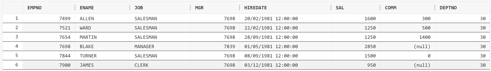

### 2. 查询薪金大于2000的雇员的编号、姓名、工作和薪金；
```sql
SELECT EMPNO, ENAME, JOB, SAL

FROM EMP

WHERE SAL > 2000;
```
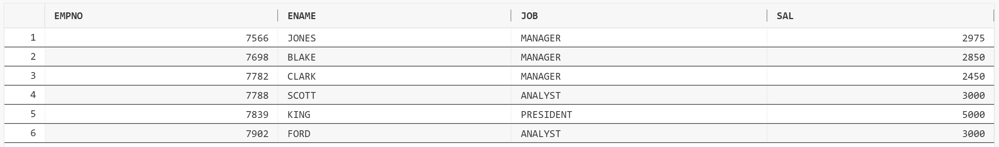

### 3. 查询所有销售员的姓名、编号和部门编号；
```sql
SELECT ENAME, EMPNO, DEPTNO

FROM EMP

WHERE JOB = 'SALESMAN';
```
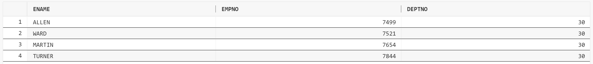

### 4. 查询佣金高于薪金的50%的雇员的所有信息；
```sql
SELECT * FROM EMP

WHERE COMM IS NOT NULL AND COMM > 0.5 * SAL;
```
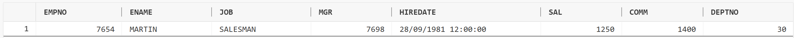

### 5. 查询第1个字母为"M"的雇员姓名；
```sql
SELECT ENAME

FROM EMP

WHERE ENAME LIKE 'M%';

```
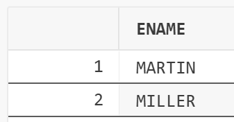
```sql
height="0.9166732283464567in"}
```

### 6. 查询雇员的姓名和雇佣日期，在显示姓名时只有第1个字母使用大写；
```sql
SELECT INITCAP(ENAME) AS ENAME, HIREDATE

FROM EMP;

```
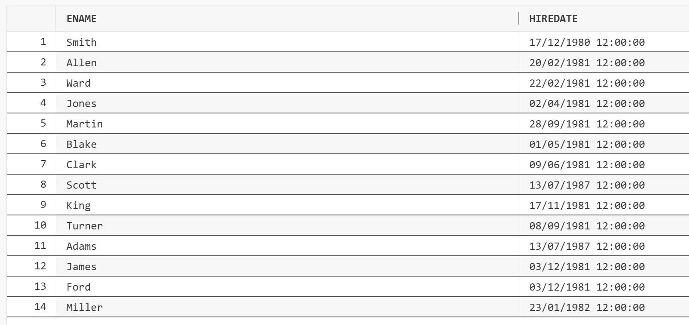
```sql
height="2.7291666666666665in"}
```

### 7. 查询姓名包含6个字符的雇员信息；
```sql
SELECT *

FROM EMP

WHERE ENAME LIKE '______';

```
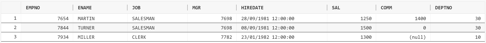
```sql
height="0.5152777777777777in"}
```

### 8. 查询姓名中不含字母"S"的所有雇员信息；
```sql
SELECT * FROM EMP

WHERE NOT (ENAME LIKE '%S%');

```
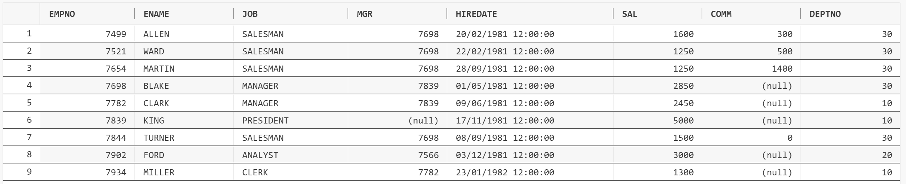
```sql
height="1.179861111111111in"}
```

### 9. 查询所有雇员的姓名，以及所承担的工作名称的前5个字符；
```sql
SELECT ENAME, SUBSTR(JOB, 1, 5) AS JOB FROM EMP;

```
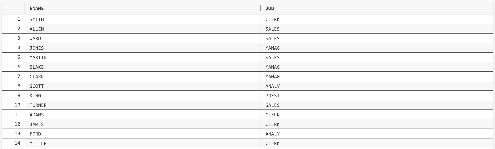
```sql
height="1.7381944444444444in"}
```

### 10. 查询没有佣金或佣金低于200的所有雇员的姓名、工作及其佣金；
```sql
SELECT ENAME, JOB, COMM FROM EMP

WHERE COMM IS NULL OR COMM < 200;

```
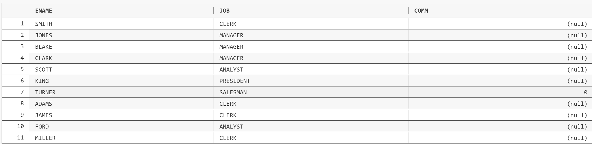
```sql
height="1.4111111111111112in"}
```

### 11. 查询收取佣金的雇员所承担的工作的名称，重复的工作名称应取消；
```sql
select distinct job

from emp

where comm is not null

or comm = 0;

!
```
[](asset/assignment5/media/image11.png){width="1.8125131233595801in"
```sql
height="0.7031299212598425in"}
```

### 12. 查询部门"20"中所有分析师和部门"30"中所有办事员的详细信息；
```sql
SELECT *

FROM EMP

WHERE (DEPTNO = 20 AND JOB = 'ANALYST') OR (DEPTNO = 30 AND JOB
= 'CLERK');

```
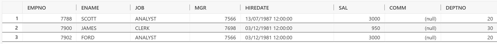
```sql
height="0.5229166666666667in"}
```

### 13. 查询部门"10"与"30"中所有经理以及部门"20"中所有分析师；
```sql
SELECT *

FROM EMP

WHERE ((DEPTNO = 10 OR DEPTNO = 30) AND JOB = 'MANAGER')

OR (DEPTNO = 20 AND JOB = 'ANALYST');
```
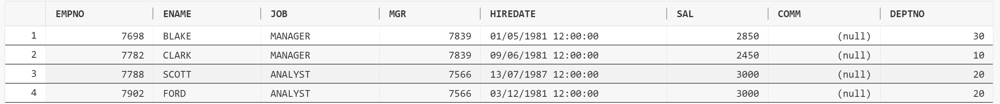
14
. 查询既不是经理又不是办事员但其薪金大于或等于1800的所有雇员的信息；
```sql
SELECT *

FROM EMP

WHERE JOB NOT IN ('CLERK', 'MANAGER') AND SAL >= 1800;

```
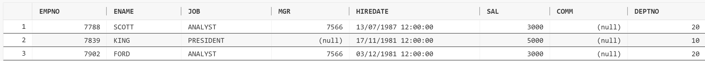
```sql
height="0.5069444444444444in"}
```

### 15. 查询雇员的编号、姓名、部门编号、工作、雇佣日期和薪金，查询结
果先按部门编号的升序排列，部门编号相同的雇员再按雇佣日期的降序排列；
```sql
SELECT EMPNO, ENAME, DEPTNO, JOB, HIREDATE, SAL FROM EMP

ORDER BY DEPTNO ASC, HIREDATE DESC;

```
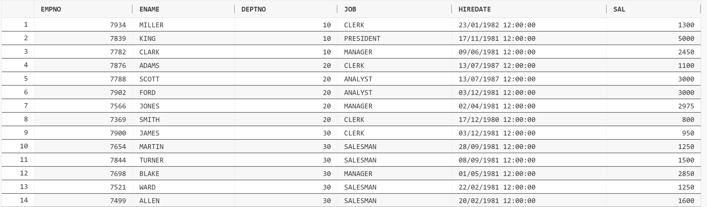
```sql
height="1.6958333333333333in"}
```

### 16. 查询所有雇员的姓名、工
作和薪金，先按工作的降序排列，具有相同工作的雇员再按薪金的升序排列；
```sql
SELECT ENAME, JOB, SAL FROM EMP

ORDER BY JOB DESC, SAL ASC;

```
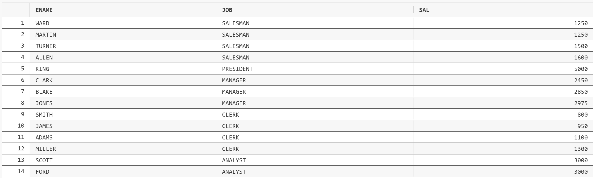
```sql
height="1.7381944444444444in"}
```

### 17. 查询所有在5月份雇佣的雇员的信息；
```sql
SELECT * FROM EMP

WHERE TO_CHAR(HIREDATE, 'MM') = '05';

```
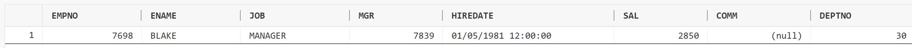
```sql
height="0.31180555555555556in"}
```

### 18. 查询在各月的最后一天被雇佣的雇员的编号、姓名和雇佣日期；
```sql
SELECT EMPNO, ENAME, HIREDATE FROM EMP

WHERE HIREDATE = LAST_DAY(HIREDATE);

```

```sql
height="1.2402777777777778in"}

未选定行
```

### 19. 查询雇员的编号、姓名，以及加入公司以来的总工作天数；
```sql
SELECT EMPNO , ENAME, TRUNC(CURRENT_DATE) - HIREDATE AS
WORKED_DAYS

FROM EMP;

```
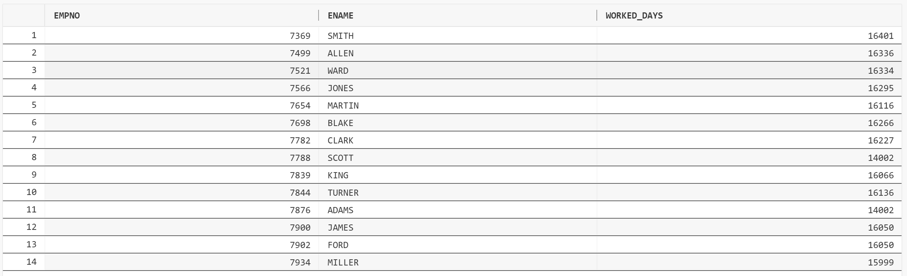
```sql
height="1.7569444444444444in"}

其中：

select distinct TRUNC(CURRENT_DATE) from emp;
```
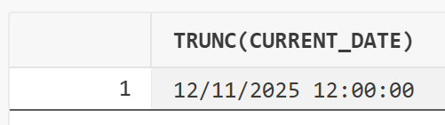

### 20. 查询所有雇员的编号、姓名，以及加入公
司的年份和月份；要求按年份的升序排列，年份相同的，按月份的升序排列；
```sql
SELECT EMPNO, ENAME, EXTRACT(YEAR FROM HIREDATE) AS YEAR
,EXTRACT(MONTH FROM HIREDATE) AS MONTH

FROM EMP

ORDER BY YEAR, MONTH;

!
```
[](asset/assignment5/media/image21.png){width="4.1198217410323705in"
```sql
height="3.95836176727909in"}
```

### 21. 查询所有雇员的姓名和年薪，要求按年薪的降序排列查询结果；
```sql
SELECT ENAME, (SAL * 12 + NVL(COMM, 0)) AS ANNUAL_SALARY

FROM EMP

ORDER BY ANNUAL_SALARY DESC;

!
```
[](asset/assignment5/media/image22.png){width="3.0833562992125985in"
```sql
height="3.9791961942257217in"}
```

### 22. 查
询已经在公司工作了三十多年的雇员的姓名、部门号、雇佣日期和工作年数；
```sql
SELECT ENAME, DEPTNO, HIREDATE,

TRUNC(MONTHS_BETWEEN(CURRENT_DATE, HIREDATE) / 12) AS
YEARS_OF_SERVICE

FROM EMP

WHERE MONTHS_BETWEEN(CURRENT_DATE, HIREDATE) / 12 > 30;

```
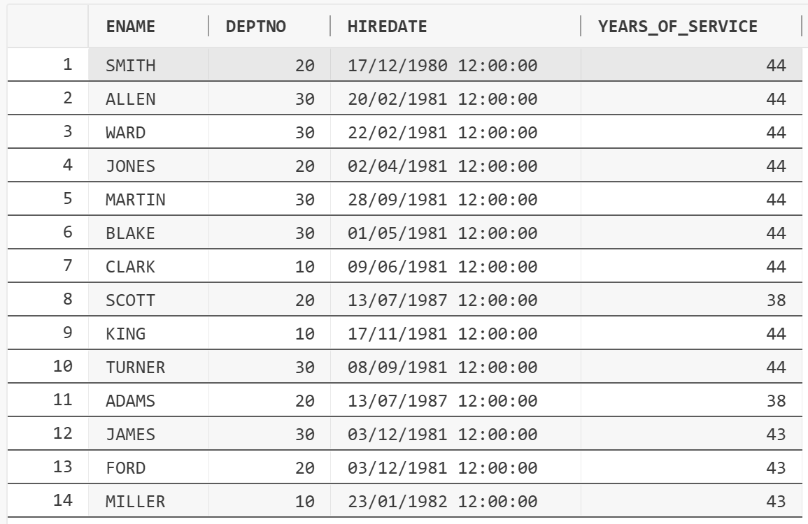
```sql
height="3.748611111111111in"}
```

### 23. 假设一个月为 30 天，计算所有雇员的日薪金（以元为单位）；
```sql
SELECT ENAME, ROUND(SAL / 30, 2) AS DAILY_SALARY

FROM EMP;

!
```
[](asset/assignment5/media/image24.png){width="3.0573140857392826in"
```sql
height="3.963570647419073in"}
```

### 24. 查询各类别工作的平均薪金和最高薪金，以及承担各项工作的雇员人数；
```sql
SELECT JOB, ROUND(AVG(SAL), 3) AS AVERAGE_SALARY, MAX(SAL) AS
MAXIMUM_SALARY, COUNT(*) AS NUMBER_OF_EMPLOYEES

FROM EMP

GROUP BY JOB;

```
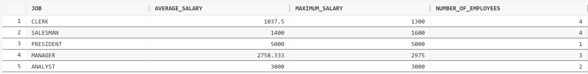
```sql
height="0.7319444444444444in"}
```

### 25. 查询最低薪金大于1400的工作的最低薪金；
```sql
SELECT JOB, MIN(SAL) AS MINIMUM_SALARY

FROM EMP

GROUP BY JOB

HAVING MIN(SAL) > 1400;

!
```
[](asset/assignment5/media/image26.png){width="3.3073162729658794in"
```sql
height="1.1927165354330709in"}
```

### 26. 查询部门"20"和"30"中的雇员人数和平均工资；
```sql
SELECT COUNT(*) AS NUMBER_OF_EMPLOYEES, AVG(SAL) AS
AVERAGE_SALARY, DEPTNO

FROM EMP

GROUP BY DEPTNO

HAVING DEPTNO IN (20, 30);

```
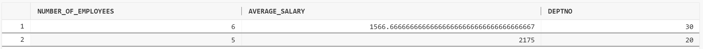
```sql
height="0.4097222222222222in"}
```

### 27. 查询办事员的最高、最低、平均和总薪金。
```sql
SELECT MAX(SAL), MIN(SAL), AVG(SAL), SUM(SAL)

FROM EMP

WHERE JOB = 'CLERK';

```
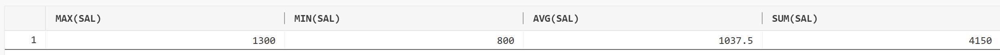
```sql
height="0.3229166666666667in"}
```

## 实验思考