# 实验六 SQL连接查询和嵌套查询

## 实验信息
- **实验环境**: Oracle11g及以上
- **实验目的**:
    - 掌握基本的连接查询操作
    - 熟悉自身连接操作
    - 熟悉外连接操作
    - 掌握带有比较运算符的子查询
    - 掌握带有IN谓词的子查询
    - 掌握带有ANY或ALL谓词的子查询
    - 熟悉带有EXISTS谓词的子查询

## 实验内容与结果
### 1. 查询所有雇员的姓名、工作和部门名称；
```sql
SELECT ENAME, JOB, DNAME

FROM EMP, DEPT

WHERE EMP.DEPTNO = DEPT.DEPTNO;

```
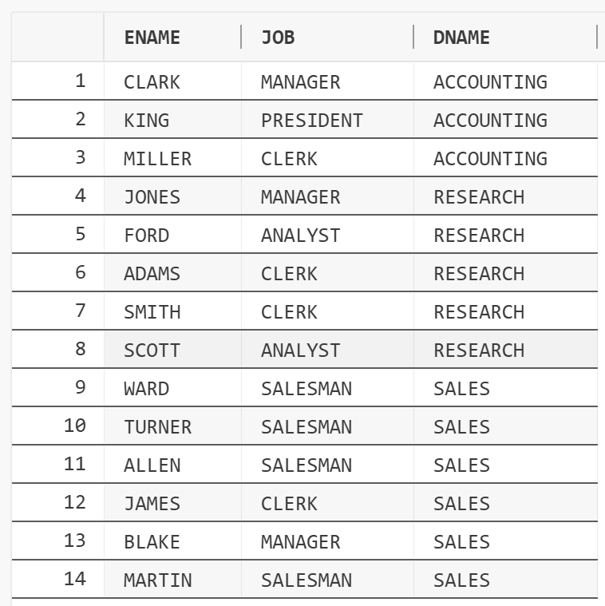
```sql
height="2.5375721784776903in"}
```

### 2. 查询所有雇员的姓名及其经理的姓名；
```sql
SELECT E1.ENAME AS ENAME, E2.ENAME AS MANAGER_NAME

FROM EMP E1, EMP E2

WHERE E1.MGR = E2.EMPNO;

```
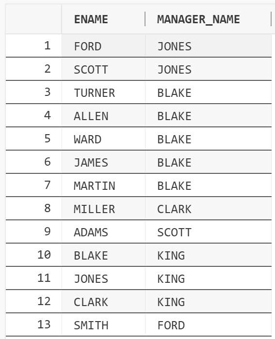
```sql
height="2.375721784776903in"}
```

### 3. 查询所有销售员（SALESMAN）的雇员编号、姓名、薪金和部门名称；
```sql
SELECT EMPNO, ENAME, SAL, DNAME

FROM EMP, DEPT

WHERE EMP.DEPTNO = DEPT.DEPTNO AND JOB = 'SALESMAN';

```
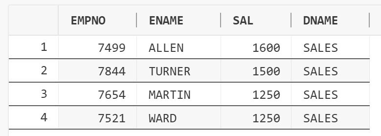
```sql
height="1.44792760279965in"}
```

### 4. 查询雇用日期早与其经理
的所有雇员的编号、姓名和雇佣日期，以及其经理的编号、姓名和雇佣日期；
```sql
SELECT E1.EMPNO AS EEMPNO, E1.ENAME AS ENAME, E1.HIREDATE AS
EHIREDATE, E2.EMPNO AS MEMPNO, E2.ENAME AS MNAME, E2.HIREDATE AS
MHIREDATE

FROM EMP E1

JOIN EMP E2 ON E1.MGR = E2.EMPNO

WHERE E1.HIREDATE < E2.HIREDATE;

```
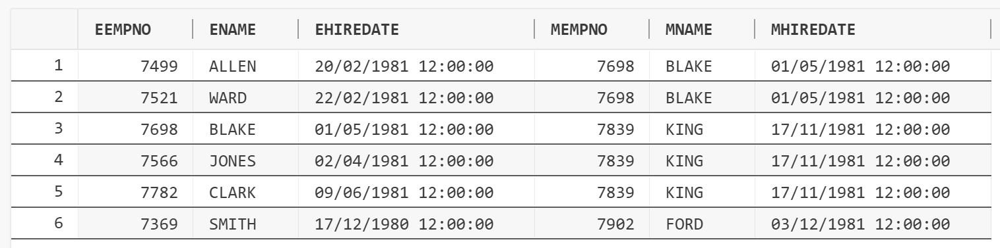
```sql
height="1.4354166666666666in"}
```

### 5. 查询薪金比"SCOTT"高的所有雇员的信息；
```sql
SELECT E1.*

FROM EMP E1, EMP E2

WHERE E1.SAL > E2.SAL

AND E2.ENAME = 'SCOTT';

```
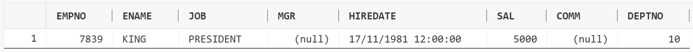
```sql
height="0.4340277777777778in"}
```

### 6. 查
询与"ALLEN"从事相同工作的所有雇员的雇员编号、姓名、雇佣日期和薪金；
```sql
SELECT EMPNO, ENAME, HIREDATE, SAL

FROM EMP

WHERE JOB IN (

SELECT JOB

FROM EMP

WHERE ENAME = 'ALLEN'

) AND ENAME <> 'ALLEN';

```
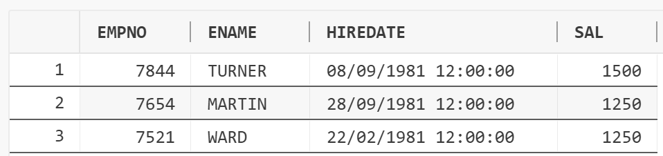
```sql
height="1.17709208223972in"}
```

### 7. 查询薪金高于公司平均水平的所有雇员的编号、姓名和薪金；
```sql
SELECT EMPNO, ENAME, SAL

FROM EMP E

WHERE E.SAL > (

SELECT AVG(SAL)

FROM EMP

);

```
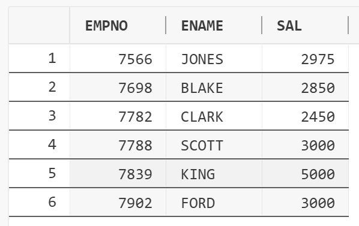
```sql
height="1.9635564304461943in"}
```

### 8. 查询部
门名称及其雇员姓名，若有些部门还没有雇员的话只要显示其部门名称即可；
```sql
SELECT DNAME, ENAME

FROM EMP

RIGHT JOIN DEPT ON EMP.DEPTNO = DEPT.DEPTNO;

或者

SELECT DNAME, ENAME

FROM EMP, DEPT

WHERE EMP.DEPTNO(+) = DEPT.DEPTNO;

```
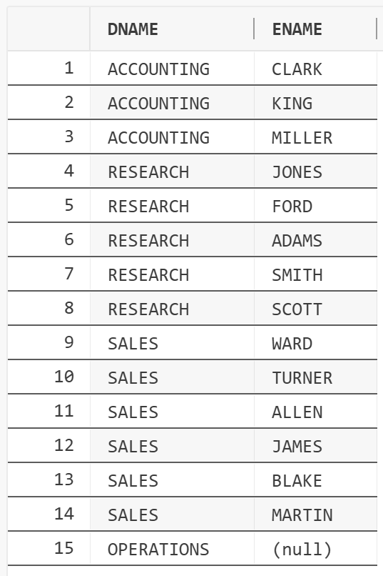
```sql
height="4.19794728783902in"}
```

### 9. 查询薪金高于部门 20所有雇员薪金的雇员的姓名和薪金；
```sql
SELECT *

FROM EMP E

WHERE SAL > ALL(

SELECT SAL FROM EMP

WHERE DEPTNO = 20

);

```
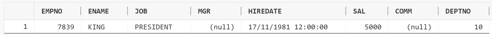
```sql
height="0.3972823709536308in"}
```

### 10. 查询薪金高于部门10中某个雇员薪金的雇员的姓名和薪金；
```sql
SELECT ENAME, SAL

FROM EMP E

WHERE E.SAL > ANY(

SELECT SAL FROM EMP

WHERE DEPTNO = 10

);

```
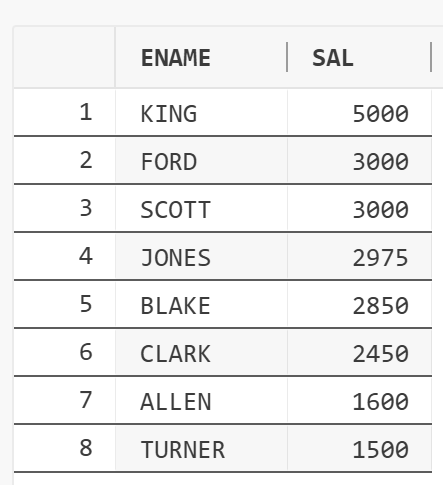
```sql
height="2.526059711286089in"}
```

### 11. 查询部门10和30
的所有雇员的姓名、部门名称和薪金，并将查询结果按部门名称的升序排序；
```sql
SELECT ENAME, DNAME, SAL

FROM EMP

JOIN DEPT ON EMP.DEPTNO = DEPT.DEPTNO

WHERE DEPT.DEPTNO IN (10, 30)

ORDER BY DNAME ASC;

!
```
[](asset/assignment6/media/image11.png){width="3.4739840332458445in"
```sql
height="2.65626968503937in"}
```
12
. 查询在各月的最后一天被雇佣的雇员的编号、姓名、雇佣日期和部门名称；
```sql
SELECT EMPNO, ENAME, HIREDATE, DNAME

FROM EMP, DEPT

WHERE EMP.DEPTNO = DEPT.DEPTNO

AND HIREDATE = LAST_DAY(HIREDATE);

```

```sql
height="0.8645898950131233in"}

未选中行
```

### 13. 查询各部门的名称，以及雇员的数量和平均薪金；
```sql
SELECT COUNT(*), ROUND(AVG(SAL), 2), DNAME

FROM EMP JOIN DEPT ON EMP.DEPTNO = DEPT.DEPTNO

GROUP BY DNAME;

```
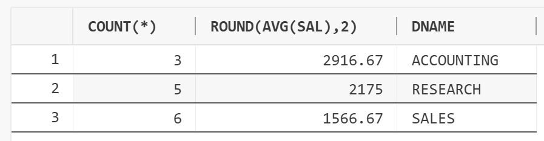
```sql
height="1.2135509623797025in"}
```

### 14. 查询薪金处于第四位的雇员的姓名、部门名称、工作和薪金；
```sql
SELECT ENAME, DNAME, JOB, SAL

FROM (

SELECT e.ENAME, d.DNAME, e.JOB, e.SAL,

DENSE_RANK() OVER (ORDER BY e.SAL DESC) AS rnk

FROM EMP e

LEFT JOIN DEPT d ON e.DEPTNO = d.DEPTNO

)

WHERE rnk = 4;

!
```
[](asset/assignment6/media/image14.png){width="4.1406550743657045in"
```sql
height="0.6875054680664917in"}
```

### 15. 查询每个部门中工资排在前2名的员工信息。
```sql
SELECT *

FROM (

SELECT e.ENAME, d.DNAME, e.JOB, e.SAL,

DENSE_RANK() OVER (ORDER BY e.SAL DESC) AS rnk

FROM EMP e

LEFT JOIN DEPT d ON e.DEPTNO = d.DEPTNO

)

WHERE rnk IN (1, 2);

!
```
[](asset/assignment6/media/image15.png){width="4.8045603674540684in"
```sql
height="1.0308814523184602in"}
```

## 实验思考
### 1. 什么是表的自身连接？在书写具有自身连接的SELECT语句时应注意什么？
```sql
表的自身连接是指一个
```
表与其自身进行连接的操作。即在FROM子句中，同一个表名出现两次或多次。
```sql
使用时需要注意：

**必须使用别名**：
由于是同一个表进行
```
连接，为了区分引用的列属于哪一个"实例"，必须为表指定不同的别名（例如
```sql
T1 和
T2）。另外，在SELECT列表或WHERE子句
```
中引用列时，必须使用定义好的别名作为前缀，以避免"列名模棱两可"的错误
```sql
**明确连接条件**：
需要清楚地定义连接条件
```
，如果FROM两张表默认使用的是笛卡尔积，必须在WHERE中写清楚对接条件。

### 2. 内连接与外连接有什么不同？在Oracle中如何进行表的外连接操作？
```sql
内连接只返回两
```
个表中满足连接条件的匹配行。外连接不仅返回满足连接条件的匹配行，还会
返回不满足条件的行，其中，左外连接返回左表的所有行，即使右表中没有匹
配项。右外连接同理。全外连接返回两个表中的所有行，无论是否有匹配项。
```sql
例如6-2-8中有两种实现方法：

**ANSI SQL 标准语法：**

SELECT DNAME, ENAME

FROM EMP

RIGHT JOIN DEPT ON EMP.DEPTNO = DEPT.DEPTNO;

以及，**Oracle 专用语法：**

SELECT DNAME, ENAME

FROM EMP, DEPT

WHERE EMP.DEPTNO(+) = DEPT.DEPTNO;
```

### 3. 在连接查询中哪些字段名的前面要加表名？
当两个或多个表中存在同名字段时，必须在这些字段名前加上表名作为前缀。
```sql
SELECT DNAME, ENAME

FROM EMP, DEPT

WHERE EMP.DEPTNO(+) = DEPT.DEPTNO;

比如以上右外连接语句中，为了区分DEPYNO来自哪张表，加表名

```
另外，查询雇员管理者的名称时，为了区分"雇员"来自哪张表也要加表名前缀
```sql
SELECT E1.ENAME AS ENAME, E2.ENAME AS MANAGER_NAME

FROM EMP E1, EMP E2

WHERE E1.MGR = E2.EMPNO;
```

### 4. 在嵌套查询中，子查询结果有多行时，父查询的WHERE条件该如何书写？
```sql
在嵌套查询中，当子查询返回多行结果时，可以使用IN、ANY、ALL、EXISTS

比如：

6-2-6：

SELECT EMPNO, ENAME, HIREDATE, SAL

FROM EMP

WHERE JOB IN (

SELECT JOB

FROM EMP

WHERE ENAME = 'ALLEN'

) AND ENAME <> 'ALLEN';

或者：

SELECT EMPNO, ENAME, HIREDATE, SAL

FROM EMP E

WHERE EXISTS (

SELECT 1

FROM EMP

WHERE ENAME = 'ALLEN' AND E.JOB = JOB

) AND ENAME <> 'ALLEN';

6-2-9：

SELECT *

FROM EMP E

WHERE SAL > ALL(

SELECT SAL FROM EMP

WHERE DEPTNO = 20

);

6-2-10：

SELECT ENAME, SAL

FROM EMP E

WHERE E.SAL > ANY(

SELECT SAL FROM EMP

WHERE DEPTNO = 10

);

5/. 带有EXISTS谓词的子查询与其他子查询有什么区别？

EXISTS不返回具体的数据行或列值，只返回逻辑真值TRUE或FAL
```
SE。其他子查询通常返回一个结果集，主查询将使用这些具体的值进行匹配。
```sql
EXISTS

```
通常用于相关子查询，一旦找到第一条匹配记录，子查询就会停止搜索并返回
```sql
TRUE。IN
通常用于不相关子查询：子查询通常先执行一次
```
，生成一个结果集，然后外层查询在每一行中检查其值是否在这个结果集中。
