# 实验七 基本表的创建、插入、更新和删除

## 实验信息
- **实验环境**: Oracle11g及以上
- **实验目的**:
    - 学会基本表的创建；
    - 掌握插入记录、更新记录和删除记录的操作。

## 实验内容与结果
### 1. 在Payment和Ptype表中插入数据。
```sql
INSERT INTO Ptype VALUES('1', 'Book');

INSERT INTO Ptype VALUES('2', 'CD');

INSERT INTO Ptype VALUES('3', 'Software');

INSERT INTO PAYMENT VALUES('1', 'Cash');

INSERT INTO PAYMENT VALUES('2', 'Check');

INSERT INTO PAYMENT VALUES('3', 'Credit Card');

INSERT INTO PAYMENT VALUES('4', 'Telegraphic Money');

```
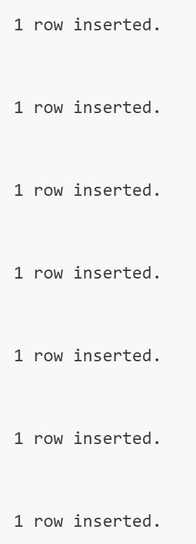
```sql
height="4.1094050743657045in"}

SELECT * FROM Ptype;

```
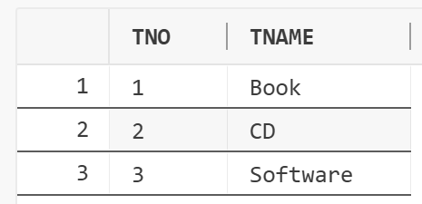
```sql
height="1.1718832020997376in"}

SELECT * FROM PAYMENT;

```
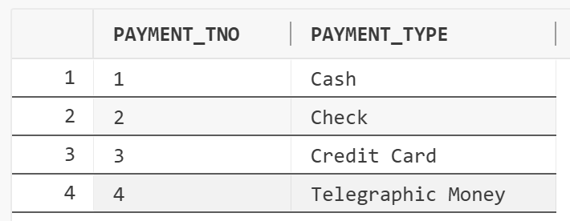
```sql
height="1.4375109361329834in"}
```

### 2. 利用INSERT语句在Orders表中直接插入5个记录。
```sql
INSERT INTO ORDERS(ONO, ORDER_DATE, CNO, FREIGHT, SHIPMENT_DATE,
CITY)

SELECT 'O0001', TO_DATE('2014-03-10', 'YYYY-MM-DD'),
'C0001', 8, TO_DATE('2014-03-11', 'YYYY-MM-DD'), 'Beijing'
FROM DUAL UNION ALL

SELECT 'O0002', TO_DATE('2014-03-11', 'YYYY-MM-DD'),
'C0002', 8, TO_DATE('2014-03-12', 'YYYY-MM-DD'),
'Shanghai' FROM DUAL UNION ALL

SELECT 'O0003', TO_DATE('2014-03-11', 'YYYY-MM-DD'),
'C0009', 5, TO_DATE('2014-03-12', 'YYYY-MM-DD'),
'Shanghai' FROM DUAL UNION ALL

SELECT 'O0004', TO_DATE('2014-04-13', 'YYYY-MM-DD'),
'C0007', 5, TO_DATE('2014-04-15', 'YYYY-MM-DD'), 'Beijing'
FROM DUAL UNION ALL

SELECT 'O0005', TO_DATE('2014-04-14', 'YYYY-MM-DD'),
'C0010', 8, TO_DATE('2014-04-16', 'YYYY-MM-DD'), 'Beijing'
FROM DUAL;

```
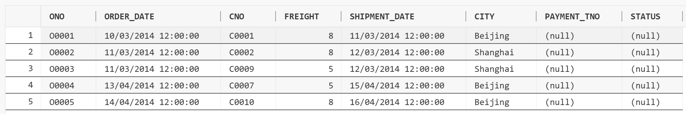
```sql
height="0.8789370078740157in"}
```

### 3. 利用INSERT语句在Orders表中用交互方式插入3个记录。
```sql
INSERT INTO ORDERS(ONO, ORDER_DATE, CNO, FREIGHT, SHIPMENT_DATE,
CITY, PAYMENT_TNO, STATUS)

VALUES('&Ono', TO_DATE('&Order_Date', 'YYYY-MM-DD'),
'&Cno', &Freight, TO_DATE('&Shipment_Date', 'YYYY-MM-DD'),
'&City', '&Payment_Tno', '&Status');

```
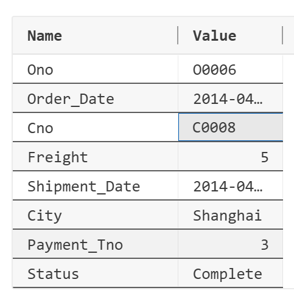
```sql
height="2.5625185914260715in"}

```
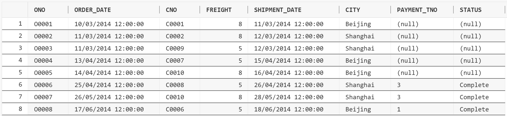
```sql
height="1.1957064741907262in"}
```

### 4. 设置Orders表前5行数据中的PAYMENT_TNO和STATUS属性的值。
```sql
UPDATE ORDERS

SET PAYMENT_TNO = '1', STATUS = 'Complete'

WHERE ONO IN ('O0001', 'O0004', 'O0005');

UPDATE ORDERS

SET PAYMENT_TNO = '2', STATUS = 'Complete'

WHERE ONO IN ('O0002', 'O0003');

SELECT * from ORDERS;

```
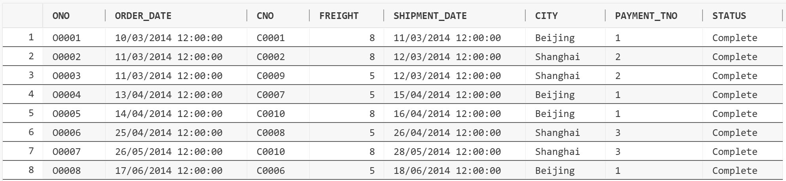
```sql
height="1.1986975065616798in"}
```

### 5. 在Product和Order_items表中插入数据。
```sql
INSERT INTO Product (PNO, PNAME, PRICE, TNO, INVENTORY) VALUES
('1001', 'Advanced Marketing', 20.5, '1', 120);

INSERT INTO Product (PNO, PNAME, PRICE, TNO, INVENTORY) VALUES
('1002', 'Visual Basic Programming', 28, '1', 200);

INSERT INTO Product (PNO, PNAME, PRICE, TNO, INVENTORY) VALUES
('1003', 'Computer Application', 30.55, '1', 80);

INSERT INTO Product (PNO, PNAME, PRICE, TNO, INVENTORY) VALUES
('1004', 'An Introduction to Database Systems', 20, '1',
12);

INSERT INTO Product (PNO, PNAME, PRICE, TNO, INVENTORY) VALUES
('1005', 'Microeconomics', 35.8, '1', 150);

INSERT INTO Product (PNO, PNAME, PRICE, TNO, INVENTORY) VALUES
('2001', 'The Lion King', 35, '2', 150);

INSERT INTO Product (PNO, PNAME, PRICE, TNO, INVENTORY) VALUES
('2002', 'Classic Disney', 25, '2', 20);

INSERT INTO Product (PNO, PNAME, PRICE, TNO, INVENTORY) VALUES
('3001', 'Microsoft Money 2010', 70.5, '3', 300);

INSERT INTO Product (PNO, PNAME, PRICE, TNO, INVENTORY) VALUES
('3002', 'Microsoft Student 2009', 80, '3', 150);

INSERT INTO Product (PNO, PNAME, PRICE, TNO, INVENTORY) VALUES
('3003', 'Norton AntiVirus 2014', 40.9, '3', 250);

INSERT INTO Product (PNO, PNAME, PRICE, TNO, INVENTORY) VALUES
('3004', 'Math Advantage 2007', 30, '3', 10);

```
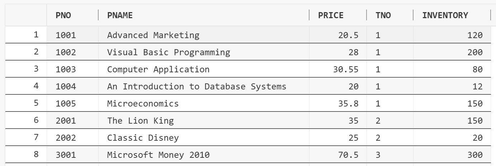
```sql
height="1.5826399825021873in"}

INSERT INTO ORDER_ITEMS (ONO, PNO, QTY, DISCOUNT) VALUES
('O0001', '1001', 5, NULL);

INSERT INTO ORDER_ITEMS (ONO, PNO, QTY, DISCOUNT) VALUES
('O0001', '1002', 1, 0.2);

INSERT INTO ORDER_ITEMS (ONO, PNO, QTY, DISCOUNT) VALUES
('O0001', '1003', 3, 0.3);

INSERT INTO ORDER_ITEMS (ONO, PNO, QTY, DISCOUNT) VALUES
('O0001', '2001', 1, 0.2);

INSERT INTO ORDER_ITEMS (ONO, PNO, QTY, DISCOUNT) VALUES
('O0001', '2002', 1, 0.2);

INSERT INTO ORDER_ITEMS (ONO, PNO, QTY, DISCOUNT) VALUES
('O0002', '1001', 2, 0.0);

INSERT INTO ORDER_ITEMS (ONO, PNO, QTY, DISCOUNT) VALUES
('O0002', '1004', 5, 0.4);

INSERT INTO ORDER_ITEMS (ONO, PNO, QTY, DISCOUNT) VALUES
('O0002', '1005', 1, 0.05);

INSERT INTO ORDER_ITEMS (ONO, PNO, QTY, DISCOUNT) VALUES
('O0002', '3003', 3, 0.3);

INSERT INTO ORDER_ITEMS (ONO, PNO, QTY, DISCOUNT) VALUES
('O0003', '1005', 1, 0.05);

INSERT INTO ORDER_ITEMS (ONO, PNO, QTY, DISCOUNT) VALUES
('O0004', '1005', 1, 0.05);

INSERT INTO ORDER_ITEMS (ONO, PNO, QTY, DISCOUNT) VALUES
('O0005', '1005', 1, 0.05);

INSERT INTO ORDER_ITEMS (ONO, PNO, QTY, DISCOUNT) VALUES
('O0006', '1004', 5, 0.4);

INSERT INTO ORDER_ITEMS (ONO, PNO, QTY, DISCOUNT) VALUES
('O0006', '1005', 1, null);

INSERT INTO ORDER_ITEMS (ONO, PNO, QTY, DISCOUNT) VALUES
('O0006', '2001', 2, 0.3);

INSERT INTO ORDER_ITEMS (ONO, PNO, QTY, DISCOUNT) VALUES
('O0006', '2002', 1, 0.2);

INSERT INTO ORDER_ITEMS (ONO, PNO, QTY, DISCOUNT) VALUES
('O0006', '3003', 2, 0.3);

INSERT INTO ORDER_ITEMS (ONO, PNO, QTY, DISCOUNT) VALUES
('O0007', '1004', 1, 0.4);

INSERT INTO ORDER_ITEMS (ONO, PNO, QTY, DISCOUNT) VALUES
('O0007', '3004', 3, 0.2);

INSERT INTO ORDER_ITEMS (ONO, PNO, QTY, DISCOUNT) VALUES
('O0008', '1002', 1, 0.2);

INSERT INTO ORDER_ITEMS (ONO, PNO, QTY, DISCOUNT) VALUES
('O0008', '2001', 3, 0.3);

INSERT INTO ORDER_ITEMS (ONO, PNO, QTY, DISCOUNT) VALUES
('O0009', '3003', 2, 0.3);

INSERT INTO ORDER_ITEMS (ONO, PNO, QTY, DISCOUNT) VALUES
('O0009', '1001', 1, null);

INSERT INTO ORDER_ITEMS (ONO, PNO, QTY, DISCOUNT) VALUES
('O0010', '1005', 1, 0.05);

```
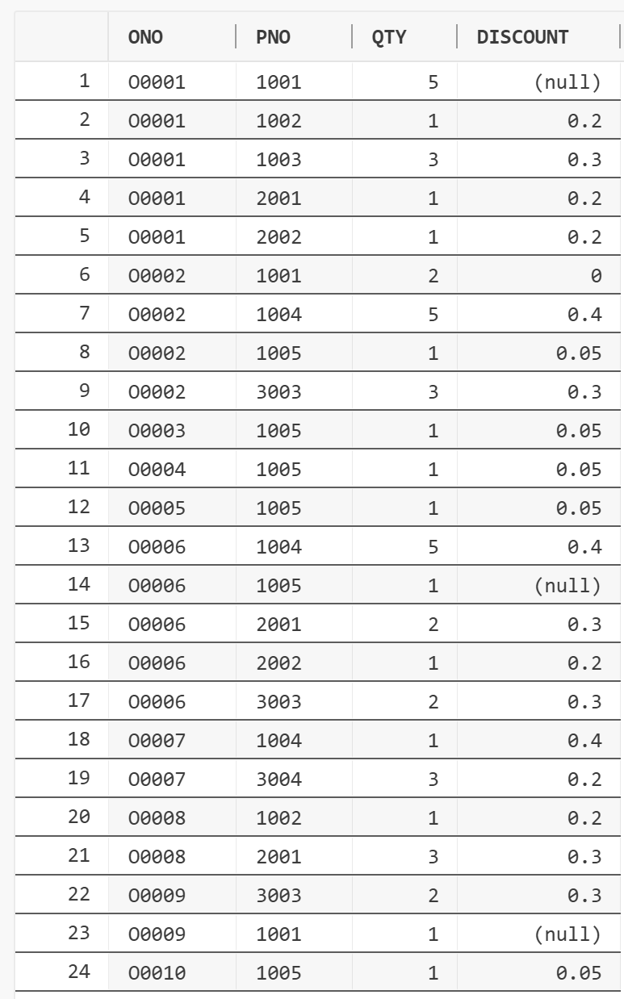
```sql
height="6.4479636920384955in"}

COMMIT;
```

### 6. 参阅表7-18给出的数据，修改Product表的产品库存。
```sql
UPDATE PRODUCT

SET INVENTORY = 110

WHERE PNO = '1001';

UPDATE PRODUCT

SET INVENTORY = 190

WHERE PNO = '1002';

UPDATE PRODUCT

SET INVENTORY = 70

WHERE PNO = '1003';

UPDATE PRODUCT

SET INVENTORY = 2

WHERE PNO = '1004';

UPDATE PRODUCT

SET INVENTORY = 140

WHERE PNO = '1005';

```
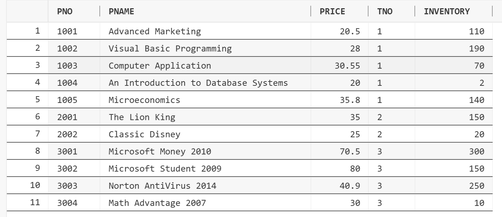
```sql
height="2.504861111111111in"}
```

### 7. 删除与 "1001"号产品有关的所有信息。
```sql
DELETE

FROM Order_items

where PNO = '1001';

```
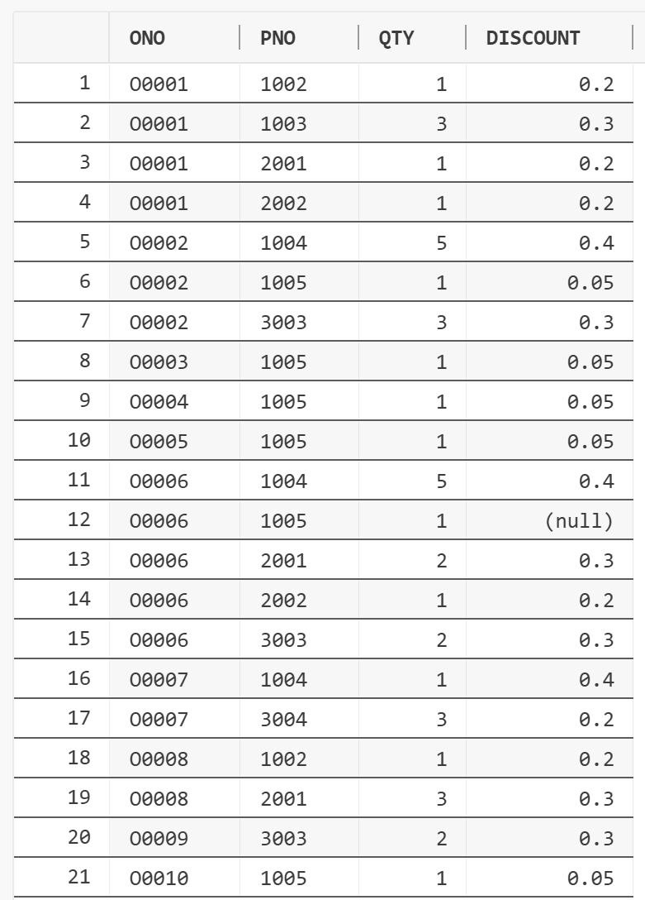
```sql
height="3.516746500437445in"}

DELETE

from Product

where PNO = '1001';

```
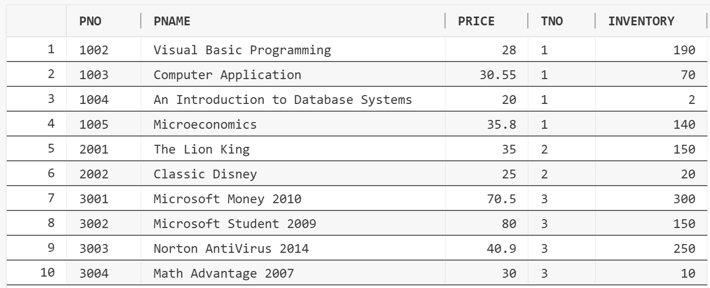
```sql
height="1.863150699912511in"}
```

### 8. 使用"CREATE TABLE ...
AS"语句从Produc
t表创建另一个名称为Product1的表，其中包含所有库存小于100的产品信息。
```sql
CREATE TABLE Product1 AS

(

SELECT * FROM Product WHERE INVENTORY < 100

);

SELECT * FROM Product1;

COMMIT;

```
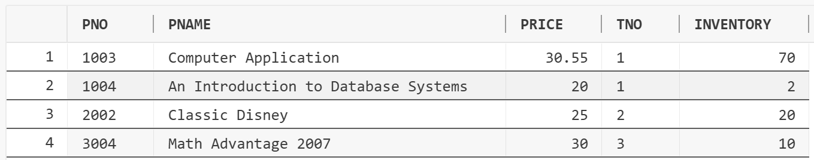
```sql
height="0.954336176727909in"}
```

### 9. 将Product1表中库存小于50的产品的库存增加200。
```sql
UPDATE PRODUCT1

SET INVENTORY = INVENTORY + 200

WHERE INVENTORY < 50;

SELECT * FROM PRODUCT1;

COMMIT;

```
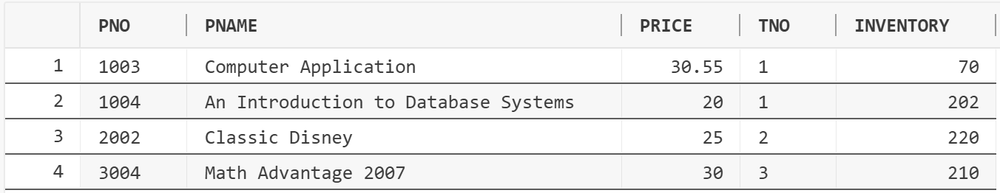
```sql
height="0.9478827646544182in"}
```

### 10. 将Employee表中所有办事员（CLERK）的薪金提高5%。
```sql
UPDATE Employee

SET sal = sal * 1.05

where JOB = 'CLERK';

COMMIT;

!
```
[](asset/assignment7/media/image15.png){width="5.0814337270341206in"
```sql
height="2.232946194225722in"}
```

### 11. 将Employee表中部门"30"的销售员（SALESMAN）的薪金增加300元。
```sql
UPDATE EMPLOYEE

set sal = sal + 300

where deptno = 30 and job = 'SALESMAN';

COMMIT;

SELECT * FROM EMPLOYEE;

```
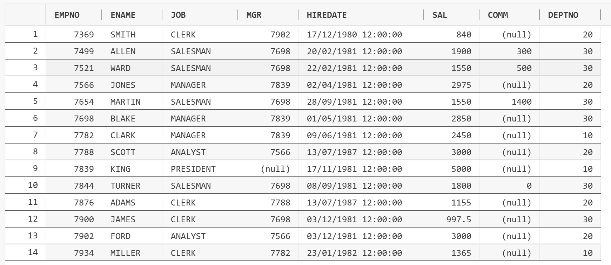
```sql
height="2.2247550306211723in"}
```

### 12. 在Employee表中将"7369"号雇员从部门"20"转到部门"30"。
```sql
UPDATE EMPLOYEE

SET DEPTNO = 30

WHERE EMPNO = 7369;

SELECT * FROM EMPLOYEE;

```
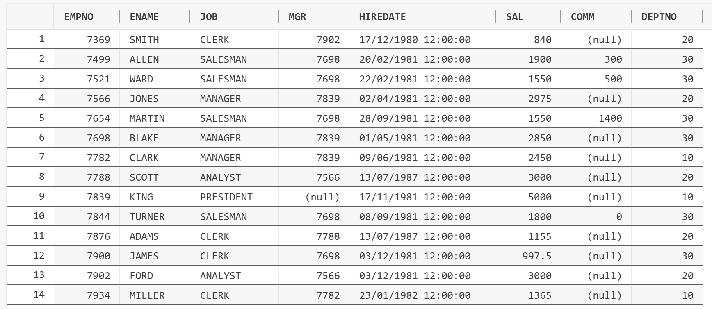
```sql
height="2.1478455818022746in"}
```

### 13. 在Employee表中，将2000年以前雇佣的职员的薪金提高1000元。
```sql
UPDATE EMPLOYEE

SET SAL = SAL + 1000

WHERE EXTRACT(YEAR FROM HIREDATE) < 2000;

select * from EMPLOYEE;

COMMIT;

```
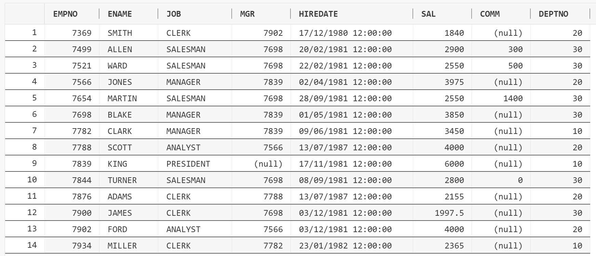
```sql
height="2.0586318897637796in"}
```

### 14. 在Employee表中删除佣金为0的销售员（SALESMAN）的信息。
```sql
DELETE FROM EMPLOYEE

where job = 'SALESMAN' and comm = 0;

SELECT * FROM EMPLOYEE where job = 'SALESMAN';

```
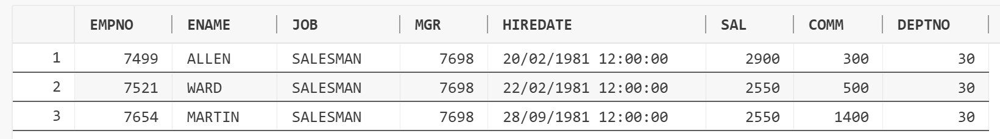
```sql
height="0.6940660542432195in"}
```

### 15. 删除部门"10"的部门信息，以及其中雇员的信息。
```sql
DELETE FROM EMPLOYEE WHERE DEPTNO = 10;

DELETE FROM DEPARTMENT WHERE DEPTNO = 10;

COMMIT;

SELECT * FROM EMPLOYEE;

SELECT * FROM DEPARTMENT;

```
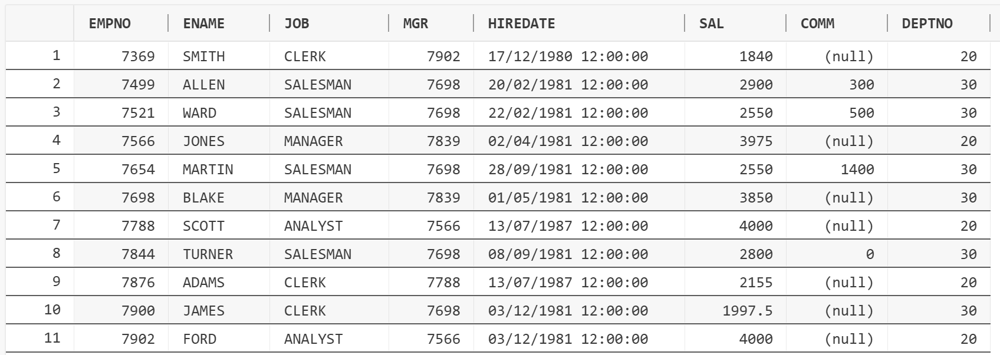
```sql
height="1.7507053805774277in"}

!
```
[](asset/assignment7/media/image21.png){width="3.7187773403324584in"
```sql
height="1.1562587489063867in"}
```

### 16. 删除Employee表中1995年之前雇佣的雇员的信息。
```sql
DELETE FROM EMPLOYEE

WHERE EXTRACT(YEAR FROM HIREDATE) < 1995;

SELECT * FROM EMPLOYEE;

COMMIT;

```

```sql
height="0.5845942694663168in"}
```

### 17. 查看"user_tables"和"user_tab_columns"
视图的内容，了解当前用户中创建了哪些基本表以及表中属性列的相关信息。
```sql
SELECT TABLE_NAME, NUM_ROWS, TABLESPACE_NAME FROM USER_TABLES;

SELECT COLUMN_NAME, DATA_TYPE, DATA_LENGTH FROM USER_TAB_COLUMNS;

```
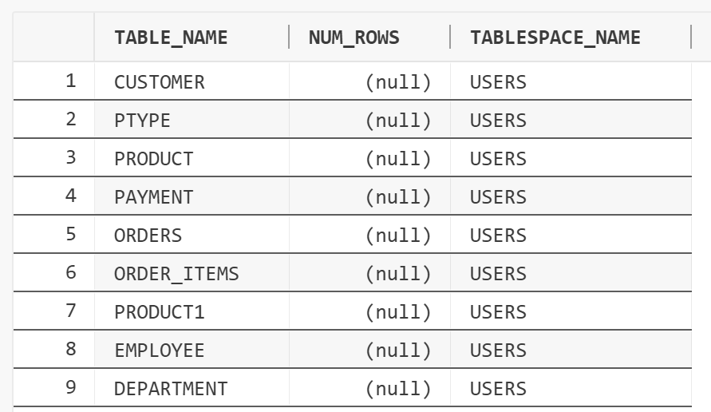
```sql
height="2.68751968503937in"}

!
```
[](asset/assignment7/media/image24.png){width="4.5521161417322835in"
```sql
height="7.885474628171479in"}

!
```
[](asset/assignment7/media/image25.png){width="4.5104494750656166in"
```sql
height="3.0208552055993in"}
```

## 实验思考