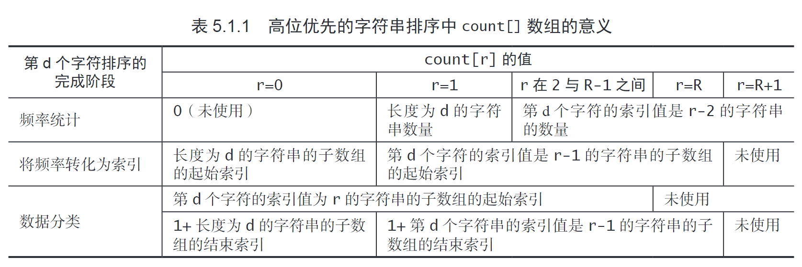
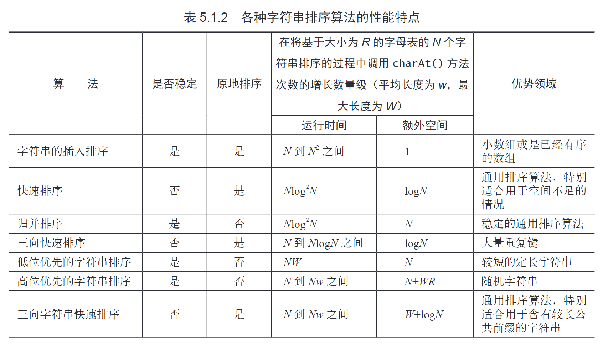
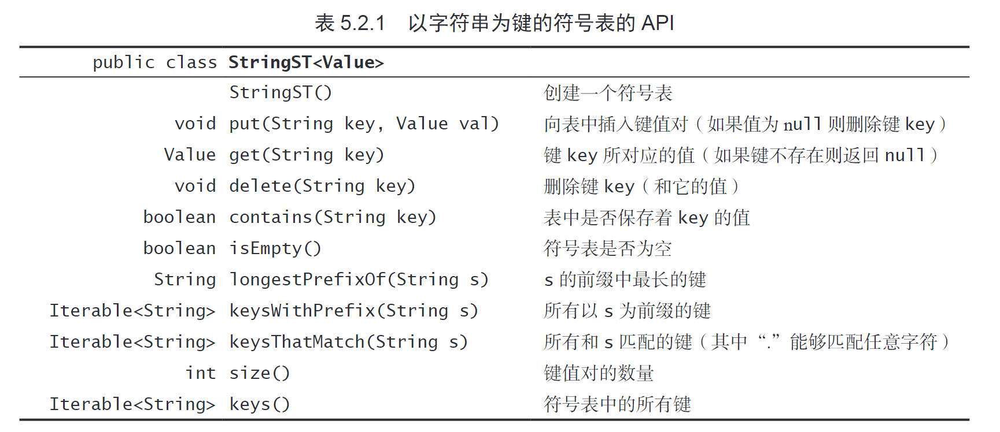
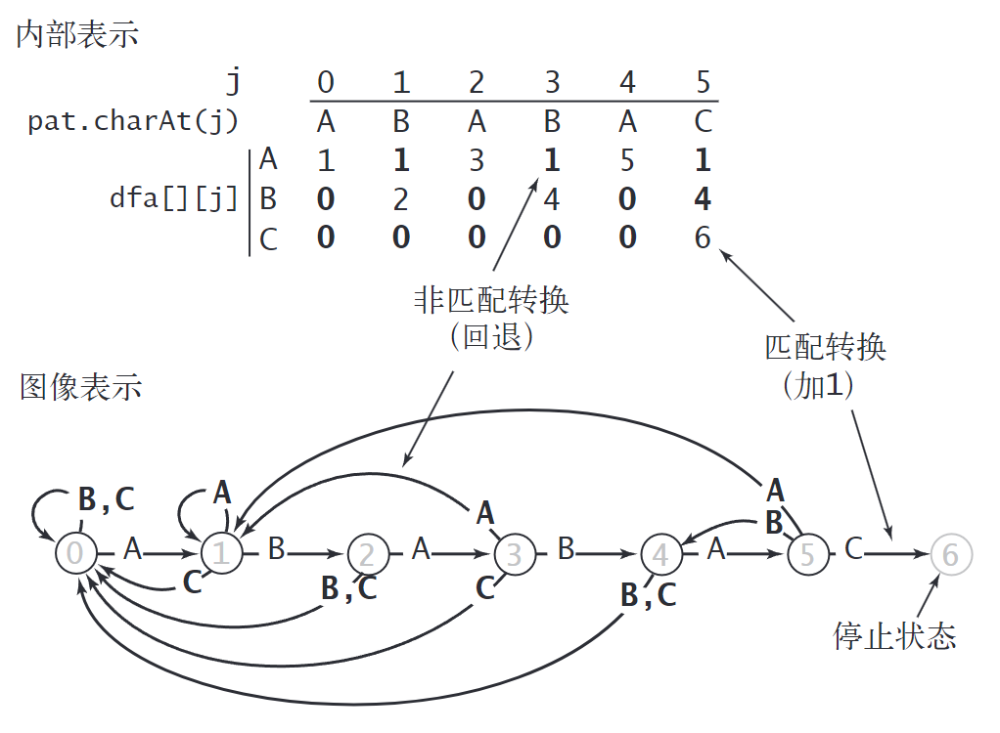
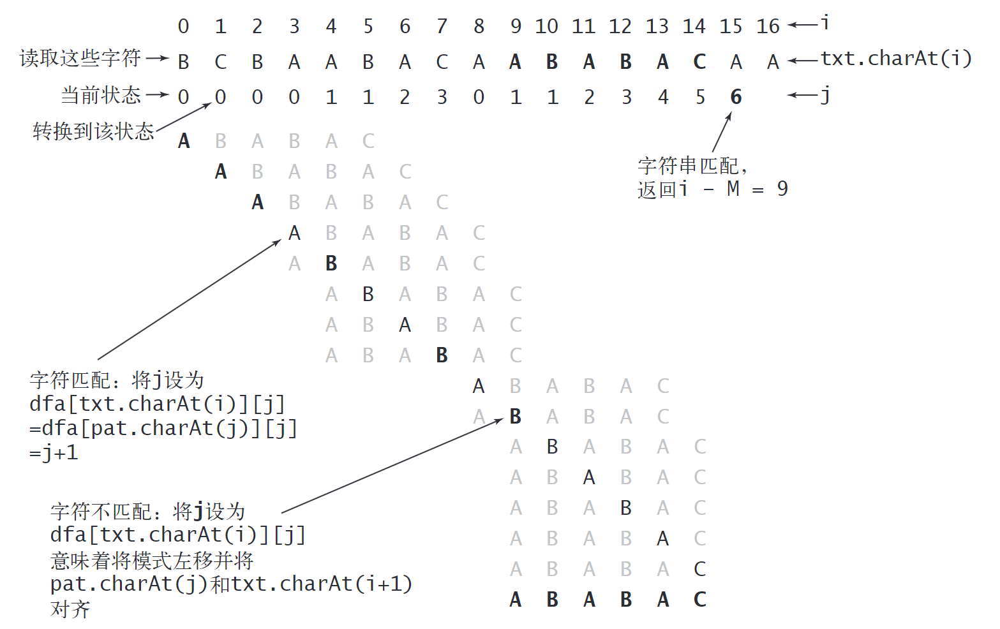

# 02 串

代码位置：`https://github.com/404NWF3/QuartzTemplate/tree/v4/content/%E6%95%B0%E6%8D%AE%E7%BB%93%E6%9E%84/%E7%AC%94%E8%AE%B0`

## 字符串排序

字符串排序是数据结构和算法中的重要内容，特别是在处理大量字符串数据时，如字典排序、数据库索引等。常见的字符串排序算法包括低位优先排序（LSD）、高位优先排序（MSD）和三向字符串快速排序。这些算法基于基数排序的思想，但处理字符串的特殊性。

### LSD (Least Significant Digit，低位优先的字符串排序)

LSD 排序从字符串的最低位（右侧）开始排序，适用于所有字符串长度相等的情况。它使用稳定的排序方式，确保相同前缀的字符串保持相对顺序。

#### 原理
- 假设所有字符串长度为 W。
- 从 d = W-1 到 0，对第 d 位字符进行排序。
- 使用计数排序（索引计数法）对每一位进行排序。

#### 索引计数法
索引计数法是一种稳定的排序方法，用于对小范围的键值进行排序。
- 创建一个计数数组 count[R+1]，其中 R 是基数（通常 256，表示 ASCII 字符）。
- 计算每个字符的频率：count[s[d] + 1]++。
- 计算累积索引：count[r+1] += count[r]。
- 根据索引将元素放入辅助数组 aux。
- 回写到原数组。

#### 实现示例
参考 LSD.cpp 文件中的实现：
- 类 LSD 接受一个字符串向量。
- sort 方法从最低位开始，使用计数排序。
- 注意：代码中 count 数组大小为 R+1，使用 s[d] + 1 来索引。

#### 优点
- 稳定排序。
- 时间复杂度 O(W * N)，其中 N 是字符串数量，W 是字符串长度。
- 适用于固定长度字符串。

#### 缺点
- 要求所有字符串长度相等。
- 对于变长字符串，需要填充或截断。

### MSD (Most Significant Digit，高位优先的字符串排序)

MSD 排序从字符串的最高位（左侧）开始排序，适用于变长字符串。它使用递归方式处理子数组。
MSD 相较 LSD 需要思考的是不同长度的字符串处理问题，如果

#### 原理
- 从 d = 0 开始，对第 d 位字符进行排序。
- 如果子数组长度小于阈值 M，使用插入排序。
- 否则，使用计数排序对当前位分组，然后递归排序每个组。

#### 索引计数法在 MSD 中的应用
- 创建计数数组 count[R+2]，多出一个位置用于处理字符串结束（当 d >= 字符串长度时）。
- 使用 a[i][d] + 2 来索引，确保结束符和字符不冲突。
- 使用 charAt 函数，在 d 超过当前字符串长度时返回 -1, 故 count[1] 在 d 越界时+1，恰好记录了长度为 d 的字符串的数量。
- 递归调用 sort(a, lo + count[r], lo + count[r+1] - 1, d + 1)。

#### 实现示例
参考 MSD.cpp 文件中的实现：
- 类 MSD 接受字符串向量。
- sort 方法递归处理。
- 注意：代码中 count 大小为 R+2，使用 a[i][d] + 2。

#### 优点
- 处理变长字符串。
- 时间复杂度平均 O(W * N)，但在最坏情况下可能更高。

#### 缺点
- 不稳定排序。
- 递归深度可能导致栈溢出。
- 需要处理字符串结束的情况。

#### 讨论

> MSD 排序的成本（时间和空间）与字母表大小 R 密切相关。count 数组大小为 R+2，频率计算和累积索引的循环次数也依赖 R。如果 R=256，但实际只用 26 个字符，浪费资源。

- Alphabet 对象：这是一个假设的类（可能自定义），表示字母表。它提供：
    - R()：返回字母表大小（例如，26 表示小写字母）。
    - toIndex(char c)：将字符 c 映射到字母表中的索引（0 到 R-1）。如果 c 不在字母表中，返回特殊值（如 -1）。
- 改动细节：
    - 构造函数：传入 Alphabet 对象，保存它，并设置 R = alpha.R()（动态调整 R）。
    - charAt() 方法：原 charAt 返回字符或 -1（结束符）。替换为 alpha.toIndex(s.charAt(d))，返回索引（0 到 R-1）或 -1（结束符）。这样，索引直接基于字母表，避免无效字符。

减少 R 后，count 数组更小，排序更快。适用于特定领域（如基因序列用 ACGT，R=4）。

> LSD 与 MSD 的比较
- **LSD**：从低位到高位，稳定，适用于固定长度。
- **MSD**：从高位到低位，不稳定，适用于变长字符串。
- count 数组大小差异：LSD 为 R+1（无结束符），MSD 为 R+2（有结束符）。

### 三向字符串快速排序
三向字符串快速排序结合了快速排序和字符串比较的思想。
- 使用三向划分：小于、等于、大于枢轴字符。
- 递归处理子数组。
- 适用于通用字符串排序，性能良好。

# 串

## 字符串排序

字符串排序是数据结构和算法中的重要内容，特别是在处理大量字符串数据时，如字典排序、数据库索引等。常见的字符串排序算法包括低位优先排序（LSD）、高位优先排序（MSD）和三向字符串快速排序。这些算法基于基数排序的思想，但处理字符串的特殊性。

### LSD (Least Significant Digit，低位优先的字符串排序)

LSD 排序从字符串的最低位（右侧）开始排序，适用于所有字符串长度相等的情况。它使用稳定的排序方式，确保相同前缀的字符串保持相对顺序。

#### 原理
- 假设所有字符串长度为 W。
- 从 d = W-1 到 0，对第 d 位字符进行排序。
- 使用计数排序（索引计数法）对每一位进行排序。

#### 索引计数法
索引计数法是一种稳定的排序方法，用于对小范围的键值进行排序。
- 创建一个计数数组 count[R+1]，其中 R 是基数（通常 256，表示 ASCII 字符）。
- 计算每个字符的频率：count[s[d] + 1]++。
- 计算累积索引：count[r+1] += count[r]。
- 根据索引将元素放入辅助数组 aux。
- 回写到原数组。

#### 实现示例
参考 LSD.cpp 文件中的实现：
- 类 LSD 接受一个字符串向量。
- sort 方法从最低位开始，使用计数排序。
- 注意：代码中 count 数组大小为 R+1（R=256），使用 s[d] + 1 来索引频率，但放置元素时使用 count[s[d]]++（可能有 bug，标准应为 count[s[d] + 1]++ 以匹配累积索引）。

#### 优点
- 稳定排序。
- 时间复杂度 O(W * N)，其中 N 是字符串数量，W 是字符串长度。
- 适用于固定长度字符串。

#### 缺点
- 要求所有字符串长度相等。
- 对于变长字符串，需要填充或截断。

### MSD (Most Significant Digit，高位优先的字符串排序)

MSD 排序从字符串的最高位（左侧）开始排序，适用于变长字符串。它使用递归方式处理子数组。
MSD 相较 LSD 需要思考的是不同长度的字符串处理问题，如果 d >= 字符串长度，则视为结束。

#### 原理
- 从 d = 0 开始，对第 d 位字符进行排序。
- 如果子数组长度小于阈值 M（代码中 M=15），使用插入排序。
- 否则，使用计数排序对当前位分组，然后递归排序每个组。

#### 索引计数法在 MSD 中的应用
- 创建计数数组 count[R+2]，多出一个位置用于处理字符串结束（当 d >= 字符串长度时）。
- 使用 charAt(a[i], d) + 2 来索引频率（charAt 返回字符或 -1，确保结束符和字符不冲突）。
- 计算累积索引：count[r+1] += count[r]。
- 根据索引将元素放入辅助数组 aux，使用 charAt(a[i], d) + 1。
- 回写到原数组。
- 递归调用 sort(a, lo + count[r], lo + count[r+1] - 1, d + 1)。

#### 实现示例
参考 MSD.cpp 文件中的实现：
- 类 MSD 接受字符串向量。
- sort 方法递归处理，辅助数组 aux 大小为 a.size()。
- charAt 函数：如果 d < s.size() 返回 s[d]，否则 -1。
- 注意：代码中 count 大小为 R+2（R=256），使用 charAt(a[i], d) + 2 索引频率，+1 索引放置。

#### 优点
- 处理变长字符串。
- 时间复杂度平均 O(W * N)，但在最坏情况下可能更高。

#### 缺点
- 不稳定排序。
- 递归深度可能导致栈溢出。
- 需要处理字符串结束的情况。

#### 讨论

> MSD 排序的成本（时间和空间）与字母表大小 R 密切相关。count 数组大小为 R+2，频率计算和累积索引的循环次数也依赖 R。如果 R=256，但实际只用 26 个字符，浪费资源。

- Alphabet 对象：这是一个假设的类（可能自定义），表示字母表。它提供：
    - R()：返回字母表大小（例如，26 表示小写字母）。
    - toIndex(char c)：将字符 c 映射到字母表中的索引（0 到 R-1）。如果 c 不在字母表中，返回特殊值（如 -1）。
- 改动细节：
    - 构造函数：传入 Alphabet 对象，保存它，并设置 R = alpha.R()（动态调整 R）。
    - charAt() 方法：原 charAt 返回字符或 -1（结束符）。替换为 alpha.toIndex(s.charAt(d))，返回索引（0 到 R-1）或 -1（结束符）。这样，索引直接基于字母表，避免无效字符。

减少 R 后，count 数组更小，排序更快。适用于特定领域（如基因序列用 ACGT，R=4）。

> LSD 与 MSD 的比较
- **LSD**：从低位到高位，稳定，适用于固定长度。
- **MSD**：从高位到低位，不稳定，适用于变长字符串。
- count 数组大小差异：LSD 为 R+1（无结束符），MSD 为 R+2（有结束符）。

### 三向字符串快速排序
三向字符串快速排序结合了快速排序和字符串比较的思想，适用于通用字符串排序。

#### 原理
- 使用三向划分：小于、等于、大于枢轴字符。
- 递归处理子数组。
- 当枢轴字符 >= 0 时，才递归处理等于部分的下一位（避免无效递归）。

#### 实现示例
参考 Quick3string.cpp 文件中的实现：
- 类 Quick3string 接受字符串向量。
- sort 方法递归，使用 charAt 函数（返回字符或 -1）。
- 三向划分：lt = lo, gt = hi, v = charAt(a[lo], d)，然后循环交换元素。
- 递归：sort(a, lo, lt-1, d); if (v >= 0) sort(a, lt, gt, d+1); sort(a, gt+1, hi, d)。

#### 优点
- 适用于变长字符串。
- 时间复杂度平均 O(W * N)，性能良好。
- 结合快速排序的效率和字符串比较的特殊性。

#### 缺点
- 不稳定排序。
- 递归深度可能较高。

## 单词查找树

### 基于单词查找树的符号表 TrieST

TrieST（Trie Symbol Table）是一种基于前缀树的符号表实现，适用于以字符串为键的键值对存储。它使用多叉树结构，每个节点代表一个字符路径，能够高效地支持插入、查找、前缀查询等操作。

#### TrieST 的结构
- **节点 (Node)**：每个节点包含：
  - `val`：存储键值对的值（类型为模板参数 `Type`）。
  - `next[R]`：指向子节点的指针数组，其中 `R = 256` 表示 ASCII 字符集的大小。
- **根节点**：树的根节点，从根开始遍历字符串的每个字符。

#### TrieST 的操作
- **插入 (put)**：从根节点开始，递归遍历字符串的每个字符，为不存在的节点创建新节点，并在字符串末尾设置值。
- **查找 (get)**：从根节点开始，递归遍历字符串，如果路径存在且末尾节点有值，则返回该值，否则返回默认值。
- **键遍历 (keys)**：返回所有键的向量，通过递归收集所有有值的节点路径。
- **前缀键遍历 (keysWithPrefix)**：返回以指定前缀开头的键，通过找到前缀节点后递归收集。
- **最长前缀查询 (longestPrefixOf)**：返回查询字符串的最长前缀匹配键。
- **删除 (remove)**：通过将值设为默认值实现简单删除（未完全实现递归清理）。

#### TrieST 的实现
参考 TrieST.cpp 文件中的实现：
- 类 `TrieST<Type>` 是模板类，支持任意值类型。
- 私有方法 `get(Node*, key, d)` 和 `put(Node*, key, val, d)` 递归处理节点。
- `collect(Node*, prefix, results)` 递归收集键。
- `search(Node*, query, d, length)` 用于最长前缀查询。
- 内存管理：析构函数调用 `deleteSubtree()` 递归删除所有节点，避免内存泄漏。

#### 优点
- 查找和插入时间复杂度 O(W)，其中 W 是字符串长度。
- 支持前缀查询和键遍历。
- 空间效率高，仅存储存在的路径。

#### 缺点
- 对于小字母表，`R=256` 浪费空间。
- 删除操作未完全实现，可能留下空节点。
- 递归实现可能导致栈溢出。

### 三向单词查找树(TST)

#### 概述
三向单词查找树（Ternary Search Trie, TST）是一种用于字符串键值对存储的高效数据结构。它结合了二叉搜索树和前缀树的特点，每个节点有三个子节点：左子节点（存储小于当前字符的键）、中子节点（存储等于当前字符的键的后续部分）和右子节点（存储大于当前字符的键）。TST 特别适用于处理大量字符串数据，如字典、自动补全和拼写检查。

#### 结构
- **节点 (Node)**：
  - `char c`：当前节点代表的字符。
  - `Type val`：如果该节点是某个键的结束，则存储对应的值。
  - `Node* left`：左子节点（字符小于 `c`）。
  - `Node* mid`：中子节点（字符等于 `c`）。
  - `Node* right`：右子节点（字符大于 `c`）。

- **根节点**：树的根，从根开始根据字符串的第一个字符选择子节点。

#### 操作
##### 插入 (put)
- 从根节点开始，递归遍历字符串的每个字符。
- 对于每个字符 `c`：
  - 如果当前节点为空，创建新节点。
  - 如果 `c < node->c`，递归到左子节点。
  - 如果 `c > node->c`，递归到右子节点。
  - 如果 `c == node->c`，递归到中子节点。
- 在字符串末尾设置 `val`。

##### 查找 (get)
- 从根节点开始，递归遍历字符串。
- 路径匹配则返回末尾节点的 `val`，否则返回默认值。

##### 键遍历
- 递归遍历树，收集所有有值的路径。

##### 前缀查询
- 类似查找，找到前缀节点后遍历子树。

#### 优点
- 空间效率高：相比标准 Trie（每个节点有 R 个子节点），TST 只需 3 个子节点。
- 支持有序操作：可以按字典序遍历键。
- 适合动态插入和删除。

#### 缺点
- 实现复杂度较高：需要处理三个方向的递归。
- 查找时间复杂度 O(W)，但在最坏情况下可能退化。

#### 与字符串三向快速排序的关系
三向字符串快速排序（Quick3string）是一种高效的字符串排序算法，灵感来源于 TST 的三向划分思想。

##### 三向快速排序原理
- 选择枢轴字符 `v = a[lo][d]`。
- 将数组分为三部分：
  - 小于 `v` 的元素。
  - 等于 `v` 的元素。
  - 大于 `v` 的元素。
- 递归排序小于和大于的部分，对于等于部分，如果 `v >= 0`（即未到字符串末尾），递归排序下一位。

##### 相似性
- **三向划分**：TST 的节点结构（左、中、右）直接对应排序中的三向划分。
- **递归处理**：两者都使用递归处理字符串的后续字符。
- **效率**：排序算法利用 TST 的思想，避免了标准快速排序在重复键时的低效。

##### 实现示例
参考 Quick3string.cpp：
- `sort(a, lo, hi, d)` 方法递归排序。
- 使用 `charAt(s, d)` 获取字符或 -1（结束符）。
- 三向划分：`lt`、`i`、`gt` 指针移动元素。

#### 总结
TST 是一种强大的字符串数据结构，与三向快速排序共享核心思想。通过 TST，可以高效地实现符号表，而排序算法则展示了 TST 划分在排序中的应用。两者结合，为字符串处理提供了灵活且高效的解决方案。

### 字符串查找

#### 暴力查找

暴力查找（Brute Force Search）是最简单的字符串匹配算法。它逐个比较文本串（txt）和模式串（pat）的字符。当字符匹配时，继续比较下一个字符；当不匹配时，将文本指针回退到模式开始位置的下一个字符，模式指针重置为0。

##### 实现示例
参考 StringSearch.cpp 文件中的实现：
- 函数 `search(const string &pat, const string &txt)` 实现暴力查找。
- 使用两个指针 i（文本）和 j（模式），匹配时 j++，不匹配时 i -= j; j = 0;（回退文本指针）。
- 如果 j == M，返回 i - M，否则 -1。

##### 时间复杂度
- 最坏情况：O((N - M + 1) * M)，其中 N 为文本长度，M 为模式长度。
- 当文本和模式有大量重复字符时，效率低下。

##### 缺点
- 效率低：文本指针频繁回退，导致重复比较。
- 不适合长文本或复杂模式。

#### KMP

KMP（Knuth-Morris-Pratt）算法是一种高效的字符串匹配算法，旨在解决暴力查找中文本指针回退的问题。它通过预处理模式串，避免不必要的比较。

KMP 要解决的问题：暴力查找的回退导致效率低下。KMP 通过预处理模式串，构建状态转移信息，使得在失配时，模式指针可以智能跳转，而文本指针不回退。

##### 方法一：确定有限状态自动机

KMP 使用确定有限状态自动机（Deterministic Finite Automaton, DFA）来实现字符串匹配。DFA 是一个状态机，每个状态代表模式串的当前匹配长度。

###### DFA 构建原理
- DFA 是一个二维数组 dfa[R][M]，其中 R=256（ASCII 字符集），M 为模式长度。
- dfa[c][j] 表示在状态 j 时遇到字符 c 后的下一个状态。
- 构建过程：
  - 初始化 dfa[pat[0]][0] = 1。
  - 对于 j 从1到M-1：
    - 复制失配情况：for (int c=0; c<R; c++) dfa[c][j] = dfa[c][X]，其中 X 是重启状态。
    - 设置匹配情况：dfa[pat[j]][j] = j + 1。
    - 更新重启状态：X = dfa[pat[j]][X]。

###### 搜索过程
- 遍历文本 txt，从 i=0, j=0 开始。
- j = dfa[txt[i]][j]。
- 如果 j == M，找到匹配，返回 i - M + 1。

###### 实现示例
参考 KMP.cpp 文件中的实现：
- 类 KMP 封装 DFA。
- 构造函数构建 dfa 数组。
- search 方法使用 DFA 进行匹配。
- showDFA 方法显示 DFA 状态。
- searchVisualized 方法可视化搜索过程。

###### 时间复杂度
- 预处理：O(M * R)，R=256。
- 搜索：O(N)，文本指针不回退。

###### 优点
- 高效：避免回退，适合长文本。
- 预处理一次，可重复使用。

##### 方法二：next数组计算

next 数组（也称前缀表或失败函数）是 KMP 的另一种实现方式，用于记录模式串中每个位置的最长前缀后缀匹配长度。当失配时，根据 next 数组跳转模式指针。

###### next 数组构建原理
- next[j] 表示模式串 pat[0..j-1] 的最长前缀后缀长度。
- 构建过程：
  - 初始化 len = 0, i = 1, next[0] = 0。
  - 当 i < M：
    - 如果 pat[i] == pat[len]，len++，next[i] = len，i++。
    - 否则，如果 len > 0，len = next[len-1]。
    - 否则，next[i] = 0，i++。

###### 搜索过程
- 使用 i（文本）和 j（模式）。
- 如果匹配，i++，j++。
- 如果失配，j = next[j-1]（如果 j > 0）。
- 如果 j == M，找到匹配。

###### 实现示例
（可参考标准 KMP next 数组实现，与 DFA 等价）

###### 时间复杂度
- 预处理：O(M)。
- 搜索：O(N)。

###### 优点
- 空间更小：next 数组大小为 M，而 DFA 为 R*M。
- 实现简单：不需要二维数组。